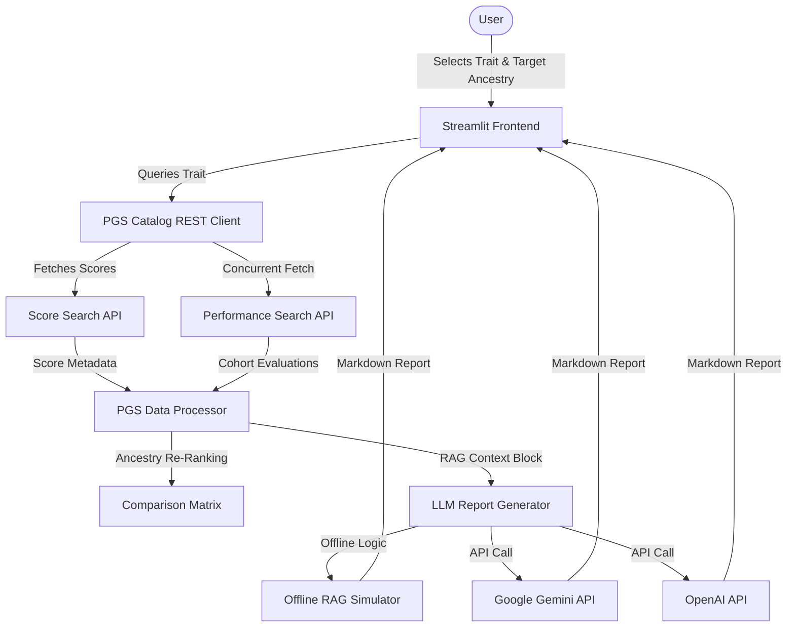

# PGS Equity Copilot 🧬

An interactive Streamlit-based intelligence dashboard that queries the public **PGS Catalog REST API**, aggregates genetic risk scoring metadata, and utilizes Large Language Models (LLMs) to evaluate representation equity and performance bias across ancestry groups.

This application is designed to demonstrate best practices in **Retrieval-Augmented Generation (RAG)**, professional software engineering, API concurrency, and clinical governance.

---

## ⚠️ Critical Warning & Disclaimer
**This tool does not calculate individual genetic risk, process personal genotype data, or provide medical advice.** 
It aggregates published study-level cohorts and uses LLMs to identify representation gaps and validation caveats. All outputs are for research and evaluation purposes only.

---

## 🌟 Key Features
- **Real-Time Catalog Queries**: Fetches traits and scores dynamically from the official [PGS Catalog REST API](https://www.pgscatalog.org/rest/).
- **Ancestry-Focused Matrix**: Re-ranks and compares available polygenic scores (PGS) based on their training (GWAS/dev) and evaluation (cohort validation) ancestry distributions.
- **Concurrent API Operations**: Implements `ThreadPoolExecutor` to concurrently fetch detailed performance metrics (like AUROC, C-index, and $R^2$) for multiple scores.
- **Flexible RAG/LLM Backend**: Integrates Google Gemini, OpenAI, local Ollama, and a fully functional **built-in Offline RAG Simulator** (allowing immediate evaluation without API keys).
- **MIT License**: Licensed under the open-source MIT License, allowing commercial use, modification, and distribution.

---

## 🏗️ System Architecture



---

## 📂 Project Structure
```
precision-med/
├── README.md                 # Project description and execution guide
├── LICENSE.md                # MIT License
├── requirements.txt          # Python dependencies
├── pyproject.toml            # Project packaging metadata
├── app.py                    # Streamlit UI dashboard entrypoint
├── pgs_copilot/              # Core implementation package
│   ├── __init__.py
│   ├── api.py                # REST API client with concurrent worker threads
│   ├── processor.py          # Data analysis, filters, and ancestry ranking
│   ├── llm.py                # LLM connectors and Offline Simulator logic
│   └── templates.py          # Prompts and rules-based fallback reports
└── tests/                    # Testing suite
    ├── __init__.py
    ├── test_api.py           # Unit tests for the API client (mocked)
    └── test_processor.py     # Unit tests for the data cleaning and ranking
```

---

## 🚀 Quick Start & Installation

### Prerequisite: Python 3.8+ or Anaconda

1. **Clone the Repository**:
   ```bash
   git clone https://github.com/yourusername/precision-med.git
   cd precision-med
   ```

2. **Create and Activate Environment**:
   *Using Conda:*
   ```bash
   conda create -n pgs-copilot python=3.10 -y
   conda activate pgs-copilot
   ```
   *Using Virtualenv:*
   ```bash
   python -m venv venv
   source venv/bin/activate  # On Windows: venv\Scripts\activate
   ```

3. **Install Dependencies**:
   ```bash
   pip install -r requirements.txt
   ```

4. **Run the Streamlit Dashboard**:
   ```bash
   streamlit run app.py
   ```

---

## 💡 RAG & Prompt Engineering Design

To demonstrate proper RAG implementation, the application does not simply dump raw JSON into the LLM. Instead:
1. **Filtering & Ranking**: The `PGSProcessor` filters out scores that do not have relevant data, ranks them based on their ancestral overlap, and selects the top 10 scores.
2. **Context Compression**: It builds a structured Markdown context highlighting:
   - Development sample ancestries (training cohorts).
   - Evaluation sample ancestries (validation cohorts).
   - Detailed performance estimates (AUROC, C-index, Beta, $R^2$) linked to specific cohorts and sample sizes.
3. **Structured Prompting**: The system prompt forces the LLM to output exactly 5 sections:
   - **Best-supported PGS for this population**
   - **Evidence gaps**
   - **Use with caution**
   - **Not enough evidence**
   - **Summary Table & Recommendations**
4. **Clinical Guardrails**: Explicitly inserts a disclaimer block and blocks the model from diagnosing or suggesting medical actions.

---

## 🔒 License
This project is licensed under the standard open-source **MIT License**. See [LICENSE.md](LICENSE.md) for full details.
